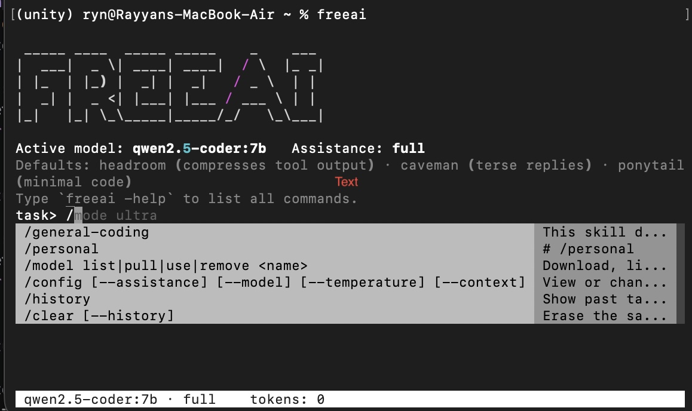

```
 _____ ____  _____ _____    _    ___
|  ___|  _ \| ____| ____|  / \  |_ _|
| |_  | |_) |  _| |  _|   / _ \  | |
|  _| |  _ <| |___| |___ / ___ \ | |
|_|   |_| \_\_____|_____/_/   \_\___|
```

<p align="center">
  
</p>
freeai is a coding assistant that runs entirely on your own computer. You describe a task in plain English, it writes a short plan, and once you approve, it works through the steps: editing files, running commands, using git, and searching the web when needed.

What sets it apart is where the work happens. freeai uses [Ollama](https://ollama.com) to run open source language models locally. You download a model once, and after that nothing you type and no file you open leaves your machine. It keeps working with no internet connection and no API key.

## How it works

You run `freeai` inside a project folder. It greets you, shows the active model and assistance level, and waits. You type something like "add input validation to the signup form". freeai turns that into a numbered plan and shows it. If it looks right, you approve, and freeai works through the steps. For each step the model picks a tool, freeai runs it, feeds the result back, and moves on. You watch the whole thing in the terminal, with a running token count at the bottom.

Nothing destructive runs without asking first. See Safety below.

## Requirements

Two things before freeai will run.

Ollama runs the AI models on your machine. freeai talks to it in the background at `localhost:11434`.

Python 3.10 or newer runs freeai itself.

## Install

```bash
brew install ollama
git clone https://github.com/16A9DA/FREEAI.git
cd FREEAI
pip install -e .
```

On Linux or Windows, install Ollama from [ollama.com](https://ollama.com) instead of using `brew`.

## First time setup

Start Ollama so the models have somewhere to run.

```bash
ollama serve
```

Download a model. `qwen2.5-coder:7b` is a good starting point for coding. The download is a few gigabytes and happens once.

```bash
freeai model pull qwen2.5-coder:7b
```

When it finishes, freeai asks whether to make it your default. Say yes and you are ready.

## Running a task

Follow these steps.

1. Open a terminal and change into the project folder you want to work in.
2. Start the assistant:

   ```bash
   freeai
   ```

3. At the `task>` prompt, type what you want in plain English, for example `add input validation to the signup form`, and press enter.
4. freeai shows a numbered plan and asks you to approve it. Use the arrow keys to choose yes or no, then press enter.
5. If you approve, freeai runs each step, calling tools and streaming its progress. If you decline, refine your task and try again.
6. When one task finishes, the prompt returns. Type your next task, or leave the session (see below).

## Leaving the session

You have three ways out of the task prompt.

```
exit     Quit the assistant.
quit     Same as exit.
/done    End the session early and print the token dashboard first.
```

Type any of them at the `task>` prompt and press enter. An empty line (just pressing enter with nothing typed) also exits. All three print a short goodbye and return you to your normal shell. Your history and settings are saved automatically, so the next `freeai` picks up where you left off.

If a task is mid-run and you need to stop it, press `Ctrl+C` to interrupt, then exit from the prompt.

## Commands

Everything runs through the one `freeai` command. No arguments starts the assistant. Everything else is a subcommand. Run `freeai help` (or `freeai -help`) for the list.

```
freeai            Start the assistant. Welcome screen and task prompt.
freeai help       List every command.
freeai model      Download, list, switch, and remove local models.
freeai config     View and change settings.
freeai history    Show your past tasks.
freeai clear      Erase the saved session memory.
freeai index      Build or refresh the search index for the current project.
```

Managing models:

```bash
freeai model pull qwen2.5-coder:7b   # download a model
freeai model list                    # show installed models, active one marked
freeai model use qwen2.5-coder:7b    # set the active model
freeai model remove qwen2.5-coder:7b # delete a model from disk
```

Ask to use a model you have not downloaded, and freeai offers to download it. Remove the model you were using, and it tells you to pick a new one. An untagged name matches a tagged pull, so `qwen2.5-coder` finds `qwen2.5-coder:7b`.

## In session shortcuts

Some commands are handled inside a session without ever calling the model, so they cost zero tokens. Type `help`, `history`, `clear`, `index`, or `model list` (and `model pull|use|remove <name>`) as plain text and freeai runs them directly.

Switch models mid session. Type `model qwen2.5-coder:7b` or `switch model to llama3` at the prompt and freeai changes the active model and keeps going. Handy for comparing how two models handle the same task.

Change the assistance level mid session with `mode <level>` or `assistance <level>`.

### Slash commands

Type `/` at the task prompt to open a menu of commands and pick one with the arrow keys, or type the name yourself. These do the same thing as the plain-text shortcuts above, run inline for zero tokens, and skip the plan and approval step.

```
/model    Download, list, switch, and remove local models. Args: list|pull|use|remove <name>
/config   View or change settings. Args: --assistance, --model, --temperature, --context
/history  Show past tasks and token usage.
/clear    Erase the saved session memory. Args: --history
/index    Build or refresh the search index for the current project.
/mode     Set the assistance level. Args: low|full|ultra
/done     End the session early and show the token dashboard.
```

Your global skills also appear in the menu by name, so you can pull one in directly.

### Autocomplete

Autocomplete helps as you type. A live dropdown appears after `mode ` and `assistance ` (the levels) and after `model ` and `switch model to ` (your pulled models); keep typing to filter. Suggestions from your past prompts appear inline as you type; press shift+tab to accept one.

Prompts that ask you to choose use arrow keys, not typed answers. Yes or no confirmations, model pick lists, and the like: use left and right or up and down, then enter. On an action that repeats, a confirmation also offers "allow all this session" so you are not asked again for that kind of action.

## What the agent can do

While working, freeai reaches for tools on its own. You do not call these. The model picks the right one for each step.

```
file        Read, write, create, delete, and search inside files.
shell       Run terminal commands.
git         Check status, view diffs, stage, commit, push, and read the log.
web         Search the web through DuckDuckGo. No account or API key.
browser     Open a web page and pull out its main text.
```

Long-running commands such as dev servers are started in the background so they do not block the loop. When freeai writes over a file, it shows a side by side diff first.

## Safety

freeai stops and asks before anything it cannot easily undo. It will not delete files, overwrite an existing file, or run a dangerous shell command (such as `rm`, `dd`, `mkfs`, or `drop table`) until you confirm. Commits happen on their own, but a `git push` always asks first and shows the remote and branch it is about to push to. The assistant can move fast, but it never surprises you with a change you did not agree to.

## Pointing at specific files

To point freeai at a file or folder, mention it with an `@` followed by a relative path.

```
fix the bug in @./src/models/user.py
use the schema from @../otherproject/schema.py
```

For a file, freeai reads it and includes a summary. For a folder, it includes the file tree so the model knows what is there.

## Skills

Skills are written instructions that shape how freeai behaves. Two kinds.

Project skills live in a file named `.freeai` in your project root, one rule per line.

```
always use type hints
never modify files in the migrations folder
prefer async functions
```

freeai looks for this file starting from your current folder and walking upward. Whatever it finds is added to every request, so the rules apply to that project automatically.

Global skills apply across every project. Each is a folder under `~/.freecode/skills/` containing a file called `SKILL.md`. The first paragraph is a short description. freeai reads only these descriptions to decide which skills fit the current task, then loads the full text of the matches. On first run it creates the skills folder with two starter skills, `general-coding` and `ponytail`.

A skill file looks like this:

```
~/.freecode/skills/django-rest/SKILL.md

Skill for building Django REST Framework APIs. Covers serializers,
viewsets, and permissions.

Rules:
- Use ModelSerializer unless a field needs custom logic.
- Put business logic in services, not views.
- Always paginate list endpoints.
```

Keep that first paragraph specific, since it is the only part freeai reads when deciding whether the skill applies. When a skill is in use, freeai prints its name so you can see what is shaping its behavior.

## Assistance levels

freeai always runs at one of three assistance levels. The level decides how much code it writes, how much it explains, and how hard it trims long tool output to save room. One setting rather than several knobs.

```
low     Most thorough. Verbose, careful, keeps the most detail.
full    Balanced. The default, no setup needed.
ultra   Writes the least code, replies tersely, trims output hard. Fastest and cheapest.
```

Set the level so it sticks:

```bash
freeai config --assistance ultra
```

Or change it for the current session at the prompt:

```
mode low
```

The active level shows on the welcome screen and the bottom bar, so you always know the mode.

One caveat. Part of the low level works by telling the model to write minimal code, and how well a model follows layered instructions varies. Smaller local models follow it less reliably than large ones. The other two parts, output trimming and reply style, are handled by freeai itself and behave the same no matter which model is active.

A rough guide: use `ultra` in an unfamiliar codebase or on something important, `full` for everyday work, and `low` once you trust the assistant on a project and want to move faster.

## Default behaviors

Three behaviors are always on, built into the prompt the agent works from. They are kept as separate, documented rulesets in `freecode/defaults.py`, each borrowed from an upstream project so you can read the original.

headroom governs how the agent handles tool output. Long results from a command or file read are shortened before the model sees them, and the full text is kept under a short reference id such as `c1`. If the model needs the part that was cut, it asks for the original by that id. This keeps the model's limited context on what matters.

caveman governs how the agent writes. Replies are terse, with filler and hedging dropped. Code, file paths, command names, and error messages are kept exact. Anything where brevity would cause confusion, such as a security warning, is written out in full.

ponytail governs how much code the agent writes. Before writing anything, it climbs a ladder looking for the smallest solution that works: reusing code already in your project, reaching for the standard library, or writing one line instead of fifty. It never cuts input validation, error handling, or security checks to save space.

How strict caveman and ponytail are follows your assistance level. As with the level itself, how closely the model obeys ponytail depends on the model. The headroom compression is handled by freeai directly and behaves the same regardless of model.

Plans are an exception. Plan output always uses caveman at its ultra intensity regardless of your assistance level, since a plan is something you scan and approve quickly, not conversation. Steps come out as short imperative fragments, no articles, no restating the task.

The upstream rulesets:

```
caveman    https://github.com/JuliusBrussee/caveman
ponytail   https://github.com/DietrichGebert/ponytail
```

## Automatic file search

On a large project, mentioning every relevant file by hand gets tedious. freeai can build a searchable index of your code so it finds the right files on its own.

The first time you give a task in a project that has not been indexed, freeai asks whether to build the index. Say yes and it reads your files, splits them into chunks, and stores a mathematical fingerprint of each chunk on disk. From then on, before each task, it searches that index for the parts of your code most related to what you asked, includes them automatically, and prints which files it pulled in. Say no and it carries on using `@` mentions only. freeai remembers your answer per project, so it does not ask again. Reset that with `freeai config --reset-prompts`.

This feature needs a second, smaller model that turns text into those fingerprints. Download it once:

```bash
freeai model pull nomic-embed-text
```

Build or refresh the index yourself at any time:

```bash
freeai index
```

The index tracks the files git tracks, skips files that are not text, and only re-reads files that changed since last time. Like everything else, it stays on your machine.

## Settings

freeai keeps its settings in `~/.freecode/config.json`: your active model, your assistance level, and other preferences. See and change them with `freeai config`.

```bash
freeai config                       # show current settings
freeai config --assistance full     # change the assistance level
freeai config --model qwen2.5-coder:7b  # set the active model
freeai config --temperature 0.2     # change how adventurous the model is
freeai config --context 8192        # change the context window size
freeai config --reset-prompts       # re-enable remembered setup prompts
```

## Terminal display

freeai adjusts to your terminal width. On a narrow window it drops columns from the token dashboard and model list and shortens the bottom status bar, so output stays readable instead of wrapping into a mess.

While a task runs, a spinner shows the current phase and a live counter tracks tokens used. At the end of a session, a table breaks down where those tokens went and flags the step that cost the most.

## Privacy

freeai runs locally from start to finish. The models run inside Ollama on your own computer at `localhost:11434`, the search index sits in your home folder, and your code, your tasks, and your queries stay on your machine. The only things that ever go out are the initial model downloads and any web searches you explicitly ask for.
</content>
